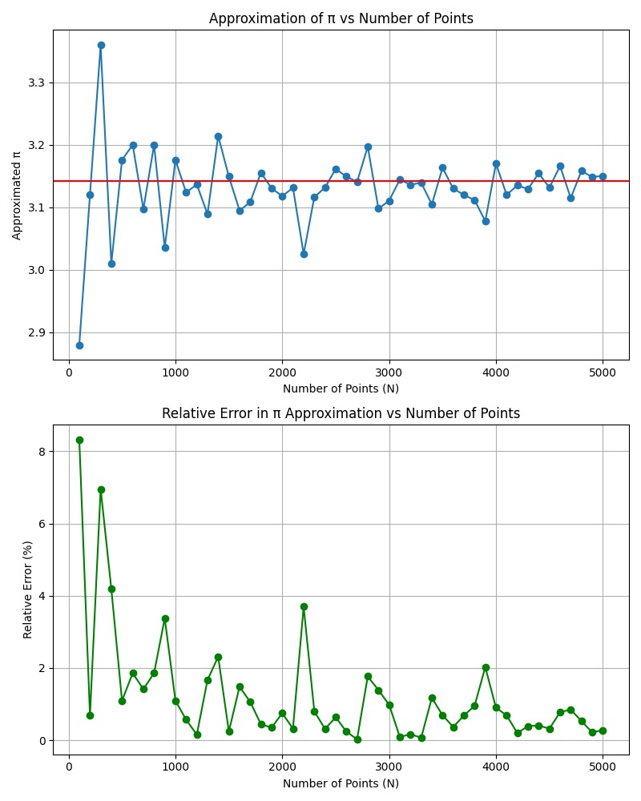

# Задача A1
В этой задаче требуется провести ряд экспериментов по вычислению приблизительного значения числа  с использованием стратегии стохастического алгоритма типа «Монте-Карло» на основе многократной генерации случайных величин. Рассмотрим круг единичного радиуса с центром в начале координат **(0, 0)**. Выполним случайную генерацию некоторого количества **N** точек, координаты которых по **x** и **y**  попадают в интервал **[-1, 1]**. 

Нам известно, что точная площадь круга с радиусом r составляет **πr^2**, а площадь квадрата (с тем же центром), в который этот круг вписан составляет **2r · 2r = 4r^2**. Составим отношение площадей: **πr^2 / 4r^2 = π / 4**.

В рамках нашего эксперимента: точная площадь круга заменяется на **M** – количество попадающих в круг точек из общего числа случайно сгенерированных, а площадь квадрата заменяется на **N**. Составим отношение таких оценок площадей: **M / N = π / 4**. Тогда, приблизительное значение числа рассчитывается следующим образом: **π = 4M / N**.
1. Разработайте программу для вычисления приблизительного значения числа по алгоритму, представленному выше. Оформите случайную генерацию координат точек в виде отдельной функции.
2. Проведите эксперименты для оценки точности вычисления значения числа  в зависимости от разного количества N случайно сгенерированных точек, которое меняется от 100 до 5000 с шагом 100. Представьте результаты проведенных экспериментов в следующем виде:\
   **График №1**, который отображает, как изменяется приближенное значение числа π, полученное в разработанной программе, в зависимости от общего числа точек N.\
   **График №2**, который отображает, как изменяется относительное отклонение (в %) приближенного значения числа π от точного в зависимости от общего числа точек N.\
   **Исходные данные**, использованные для построения графиков.
3. Опишите полученные вами результаты и представьте выводы.
Для удобства представления, графики можно разделить по значениям **N**.

# Решения
Я предполагаю, что не нужно было решать задачу на C++, поскольку сначала считать в плюсах а потом строить графики по точкам в desmos.. глупая идея.\
Решение представлено в файле [main.py](main.py).

Пример выполнения кода на данных, представленных в [example.log](examples/example.log):

Из полученных результатов можно сделать вывод, что стохастический алгоритм типа «Монте-Карло» эффективен для вычисления точного занчения числа π, поскольку с увеличением числа точек N точность оценки увеличивается, а относительное отклонение уменьшается.