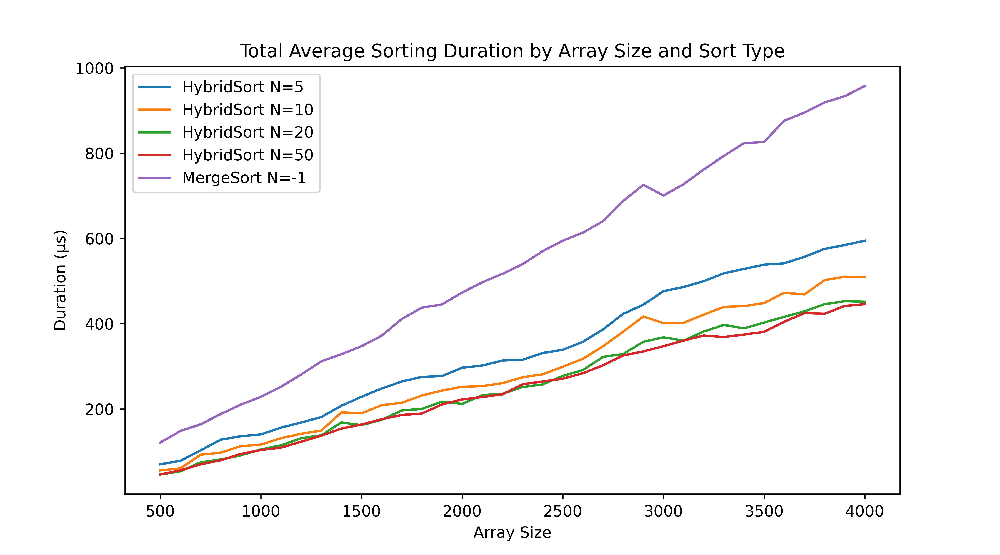
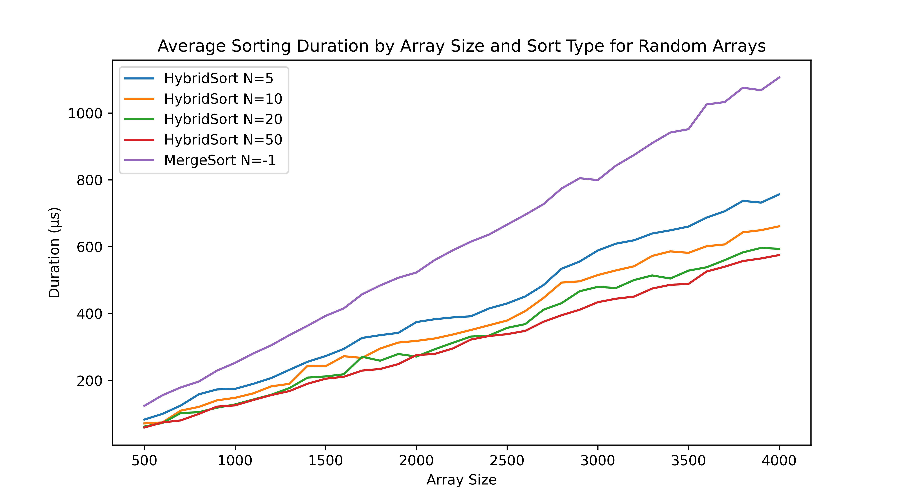
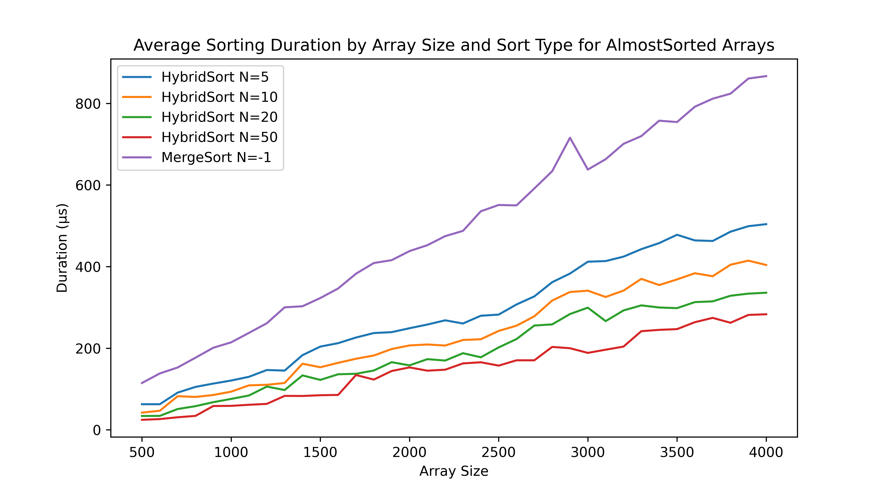
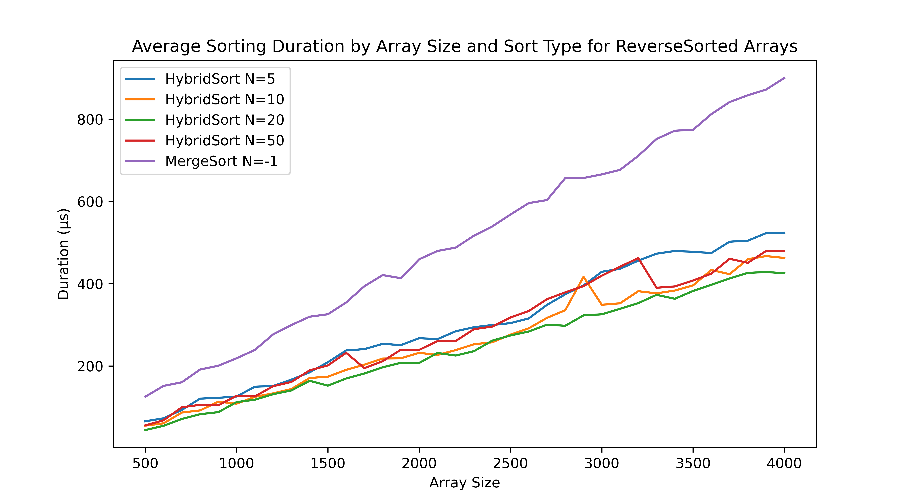

# Задача A2

В рамках этой задачи требуется сравнить эмпирические оценки временной сложности двух реализаций алгоритма MERGE SORT:

- стандартной (с выделением дополнительной памяти) и
- гибридной, в которой на малых размерах массивов выполняется INSERTION SORT.

Для проведения экспериментов по оценке и сравнению временной сложности MERGE и MERGE+INSERTION SORT в зависимости от того, для какого размера массива вызывается INSERTION SORT, необходимо подготовить тестовые данные.

# Решения

Для получения наиболее релевантных результатов тесты проводились внутри Docker-контейнера. Тестирование было проведено 5 раз, сырые данные из них можно видеть в папке [py](src/py/).

Усредненные данные по всем видам массивов:

Усредненные данные по случайным массивам:

Усредненные данные по почти отсортированным массивам:

Усредненные данные по массивам, отсортированным в обратном порядке:

Если хотите сами потыкать в программу - пользуйтесь командами из Makefile.

### Примечания по данным
1. Каждое новое измерение проводилось на новых тестовых данных
2. Чтобы получить пример тестовых данных, используйте `make gen-tests`
3. Измерения представленны в микросекундах, потому что сортировки выполнялись за 1-2 мс.
4. Программы генерации данных и сортировки - две отдельные программы, поэтому данные передаются через JSON файл. Поскольку для AlmostSorted нельзя просто "испортить" исходный массив, а потом брать с него срезы, в JSON хранятся все срезы сразу. Размер файла около 5 МБ (~ 250тыс строк), будте аккуратнее :)

### Выводы
1. Гибридная сортировка лучше MergeSort на любых массивах (среди протестированных).
2. При увеличении N (параметра вызова INSERTION SORT) можно заметить уменьшение времени работы алгоритма. Разница между `N=20` и `N=50` незначительна, скорее всего дальнейшее увеличение не сделает алгоритм еще быстрее, точную оценку можно посчитать аналитически.
3. Можно видеть, что уменьшение N при работе с обратно-отсортированными массивами имеет неоднозначный результат.
